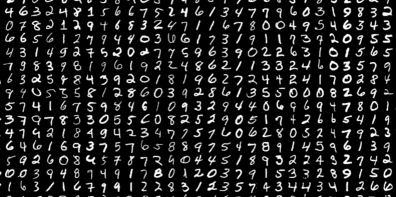

# MNIST Digit Recognition with PyTorch



This project implements a **Convolutional Neural Network (CNN)** using PyTorch to classify handwritten digits from the MNIST dataset. The model achieves **~99% accuracy** on the test set and can be used to predict digits from custom images.

## Table of Contents
- [Installation](#installation)
- [Usage](#usage)
- [Project Structure](#project-structure)
- [Results](#results)
- [License](#license)

---

## Installation

1. **Clone the repository**:
   ```bash
   git clone https://github.com/your-username/mnist-digit-recognition.git
    cd mnist-digit-recognition

2. **Install dependencies**:

    ```bash
    pip install -r requirements.txt

---

## Usage

**Training the Model**

To train the CNN model on the MNIST dataset:

   ```bash
    python src/train.py

**Testing the Model**

To test the model on the MNIST test set:


**Predicting a Custom Image**

To predict a digit from a custom image (e.g., your_digit.jpg):

    ```bash
    python src/predict.py --image path/to/your/image.jpg

---

## Project Structure

mnist-digit-recognition/
├── .gitignore            # Specifies files to ignore
├── LICENSE               # MIT License
├── README.md             # Project overview
├── requirements.txt      # Python dependencies
├── data/                 # MNIST dataset (downloaded automatically)
├── models/               # Saved model weights
├── images/               # Example images
├── src/                  # Source code
│   ├── train.py          # Training script
│   ├── test.py           # Testing script
│   ├── predict.py        # Prediction script
│   ├── model.py          # CNN model definition
│   ├── utils.py          # Helper functions (if any)

---

## Results

 - Test Accuracy: 98.2%

## License

This project is licensed under the MIT License. See LICENSE for details.

---

## Acknowledgments

 - The MNIST dataset for providing the handwritten digit images.

 - PyTorch for the deep learning framework.

---

## Contact

For questions or feedback, feel free to reach out:

 - Diyorbek Umaraliyev: d.umaraliyev@newuu.uz
 - GitHub: @umaraliyev0101
 - Telegram: @umaraliyev0101

---

### **Key Improvements**:
1. **Clear Structure**: Added a table of contents for easy navigation.
2. **Visuals**: Included placeholders for images (e.g., MNIST examples, prediction results).
3. **Detailed Usage**: Explained how to train, test, and predict with the model.
4. **Project Structure**: Added a folder structure overview.
5. **Acknowledgments**: Gave credit to the MNIST dataset and PyTorch.
6. **Contact Info**: Added a section for questions or feedback.

---

### **How to Add Images**:
1. Create an `images/` folder in your project.
2. Add your images (e.g., `mnist_example.png`, `prediction_example.png`).
3. Reference them in the `README.md` using:
   ```markdown
   
